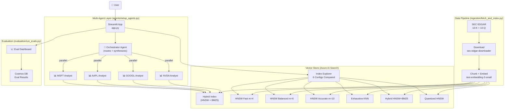

# EDGAR Multi-Agent Comparator

**Agentic AI Rag Comparator and Evaluator** — compare 10-K and 10-Q filings for MSFT, AAPL, GOOGL, and NVDA using multi-agent orchestration, advanced vector search, and a live evaluation dashboard.

---

## Architecture



---

## HNSW Parameter Reference

| Config | m | efConstruction | efSearch | Index RAM | Query Speed | Recall |
|--------|---|----------------|----------|-----------|-------------|--------|
| **HNSW Fast** | 4 | 400 | 500 | Lowest | Fastest | ~88% |
| **HNSW Balanced** | 6 | 600 | 700 | Medium | Fast | ~93% |
| **HNSW Accurate** | 10 | 1000 | 1000 | Highest | Moderate | ~98% |
| **Exhaustive KNN** | — | — | — | Same as HNSW | O(n) slow | **100%** |
| **Hybrid HNSW+BM25** | 6 | 600 | 700 | Medium | Fast | ~95% |
| **Quantized HNSW** | 6 | 600 | 700 | ~75% less | Fast | ~95% |

> **Azure AI Search limits:** m ∈ [4, 10], ef ∈ [100, 1000]

**Key concepts:**
- **m** — bidirectional links per node in the HNSW graph. Higher → better recall, more RAM
- **efConstruction** — beam width during index build. Higher → better graph quality, slower indexing
- **efSearch** — beam width at query time. Higher → better recall, slower queries
- **Scalar quantization** — float32 (4 bytes/dim) → int8 (1 byte/dim), ~75% RAM reduction
- **Recall@k** — measured as |HNSW results ∩ KNN results| / k (KNN = ground truth)

---

## Project Structure

```
edgar-comparator/
├── .env                          # Secrets & config (never commit)
├── config.py                     # Central config loader — all modules import from here
├── main.bicep                    # Deploys Cosmos DB + Storage into existing RG
├── setup.sh                      # One-shot setup script
├── requirements.txt              # uv-compatible dependencies
├── app.py                        # Streamlit UI (Chat + Index Explorer + Evals)
│
├── ingestion/
│   └── fetch_and_index.py        # EDGAR download → chunk → embed → 6 indexes
│
├── agents/
│   └── setup_agents.py           # Company agents + AppOrchestrator class
│
└── evaluation/
    ├── run_evals.py              # RAG Triad + cross-index recall benchmark
    └── results.json              # Generated by run_evals.py
```

---

## Quick Start (WSL2 / Ubuntu)

### Prerequisites

```bash
# Azure CLI
curl -sL https://aka.ms/InstallAzureCLIDeb | sudo bash
az login

# uv (fast Python package manager)
curl -Lsf https://astral.sh/uv/install.sh | sh
```

### Setup & Run

```bash
# 1. Enter project directory
cd /path/

# 2. One-shot setup (installs deps, validates .env, optionally deploys Bicep)
chmod +x setup.sh && ./setup.sh

# 3. Download EDGAR filings and build all 6 vector indexes  (~10-15 min)
uv run python -m ingestion.fetch_and_index

# 4. Create company agents + orchestrator in Foundry
uv run python -m agents.setup_agents --setup

# 5. Launch the Streamlit app
uv run streamlit run app.py

# 6. (Optional) Run evaluation suite
uv run python -m evaluation.run_evals
```

### Test the agent CLI

```bash
# Compare NVDA and MSFT R&D spend
uv run python -m agents.setup_agents \
  --query "Compare NVIDIA and Microsoft R&D expenses as % of revenue" \
  --tickers NVDA,MSFT

# Auto-route across all companies
uv run python -m agents.setup_agents \
  --query "Which company has the highest gross margin?"
```

---
